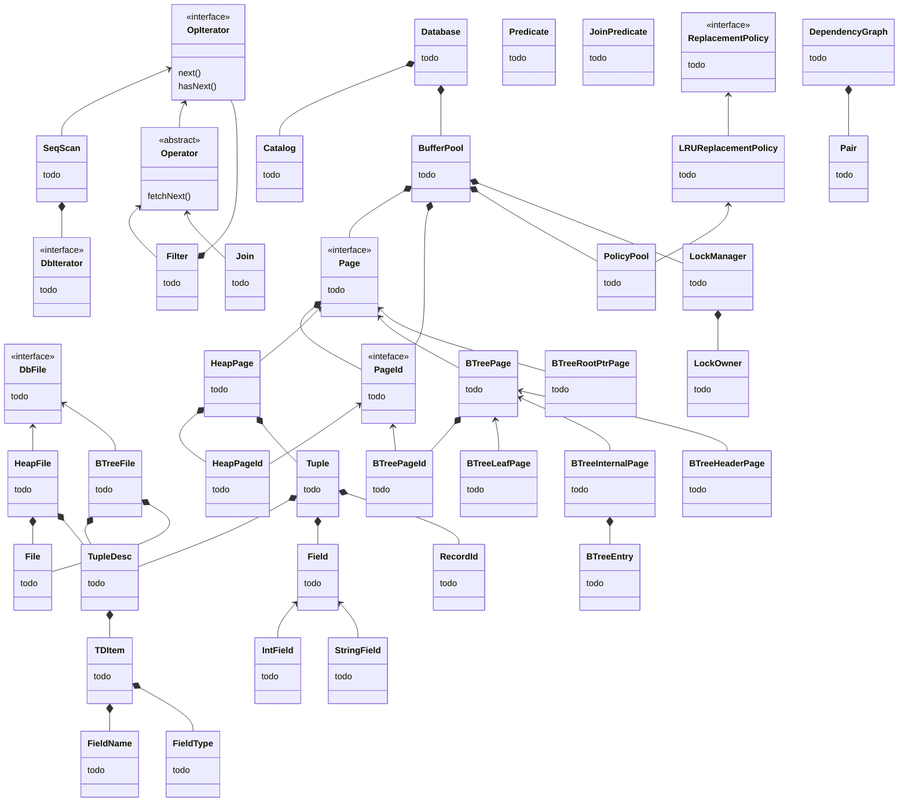

```mermaid
classDiagram

class Database {
    todo
}

class Catalog {
    todo
}

Database *-- Catalog
Database *-- BufferPool

class DbFile {
    todo
}

<<interface>> DbFile

class HeapFile {
    todo
}

DbFile <-- HeapFile

class File {
    todo 
}

HeapFile *-- File

class BufferPool {
    todo
}

class Page {
    todo
}


<<interface>> Page

BufferPool *-- Page

class PageId {
    todo
}

<<inteface>> PageId

Page *-- PageId

BufferPool *-- PageId

class HeapPage {
    todo
}

Page <-- HeapPage 


class HeapPageId {
    todo
}

PageId <-- HeapPageId

HeapPage *-- HeapPageId

class Tuple {
    todo
}

HeapPage *-- Tuple

class TupleDesc {
    todo 
}

Tuple *-- TupleDesc
HeapFile *-- TupleDesc

class Field {
    todo
}

Tuple *-- Field

class RecordId{
    todo
}
Tuple *-- RecordId

class IntField{
    todo
}

Field <-- IntField

class StringField{
    todo 
}

Field <-- StringField

class TDItem {
    todo
}

TupleDesc *-- TDItem

class FieldName {
    todo
}

TDItem *-- FieldName

class FieldType {
    todo
}

TDItem *-- FieldType

class OpIterator {
    next()
    hasNext()
}

<<interface>> OpIterator

OpIterator <-- SeqScan
OpIterator <-- Operator 

<<abstract>> Operator

class Operator {
    fetchNext()
}

class SeqScan {
    todo
}

class DbIterator {
    todo
}

<<interface>> DbIterator

SeqScan *-- DbIterator


class Predicate {
    todo
}

class JoinPredicate {
    todo
}

class Filter {
    todo
}

Operator <-- Filter

class Join {
    todo
}

Operator <-- Join

Filter *-- OpIterator


class LRUReplacementPolicy {
    todo
}

class PolicyPool {
    todo
}

LRUReplacementPolicy <-- PolicyPool

BufferPool *-- PolicyPool


class ReplacementPolicy {
    todo
}

<<interface>> ReplacementPolicy

ReplacementPolicy <-- LRUReplacementPolicy

class LockManager {
    todo
}

BufferPool *-- LockManager

class LockOwner {
    todo
}

LockManager *-- LockOwner

class Pair {
    todo
}

class DependencyGraph {
    todo
}

DependencyGraph *-- Pair


class BTreeFile {
    todo
}

DbFile <-- BTreeFile

BTreeFile *-- TupleDesc

BTreeFile *-- File


class BTreePage {
    todo
}

Page <-- BTreePage

class BTreeRootPtrPage {
    todo
}

Page <-- BTreeRootPtrPage


class BTreePageId {
    todo
}

PageId <-- BTreePageId

BTreePage *-- BTreePageId

class BTreeLeafPage {
    todo
}

BTreePage <-- BTreeLeafPage


class BTreeInternalPage {
    todo
}

BTreePage <-- BTreeInternalPage

class BTreeHeaderPage {
    todo
}

BTreePage <-- BTreeHeaderPage

class BTreeEntry {
    todo
}

BTreeInternalPage *-- BTreeEntry

```